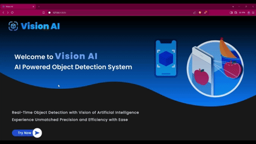
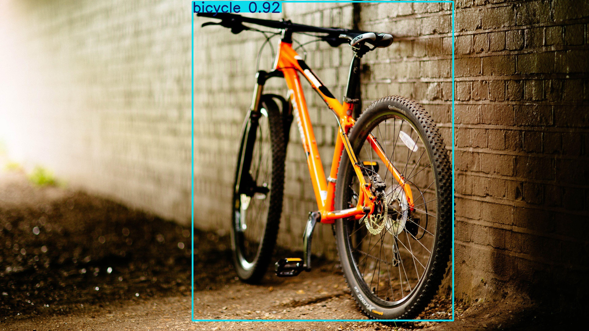
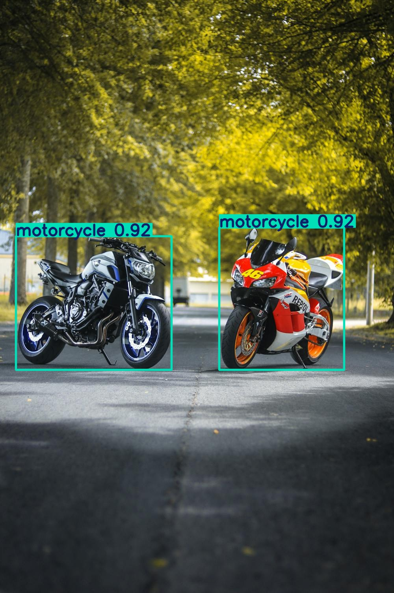
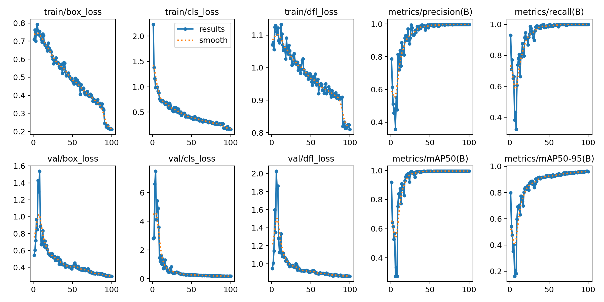

# Automated End-to-End Custom Model Builder

**A Deep Learning-based system that automates custom dataset creation, annotation, training, and inference for object detection using YOLOv8.**

This project allows users to create custom datasets, automatically annotate images, train YOLO models, and test detection on images and videos with minimal manual effort.

---

## 🎥 Demo

  
*Real-time detection using the trained YOLOv8 model.*

---

## Problem

Creating and training object detection models from scratch requires:

- Manual dataset annotation (time-consuming and error-prone)
- Dataset preparation
- Model training setup
- Testing and evaluation

This process is challenging for non-experts and slows down experimentation and prototyping.

---

## Solution

- **Automated dataset creation and annotation** for any custom object class.
- **Custom YOLOv8 model training** with minimal dataset for quick experimentation.
- **Inference on images and videos** using the trained model.
- Web interface for smooth interaction without coding.
- Efficient transfer learning using pretrained YOLO models.

---

## Outcome / Impact

- Fully automated **dataset creation and model training** pipeline.
- Rapid prototyping of custom object detection models.
- Clear **performance metrics** for trained models.
- Portfolio-ready demonstration of end-to-end AI model development.

---

## Key Features

- Automatic annotation of uploaded images for custom classes.
- YOLOv8 training on custom datasets.
- Test inference on both images and videos.
- Store and manage trained models dynamically.
- Minimal dataset approach with transfer learning.

---

## Tech Stack

- **Deep Learning:** YOLOv8 (Ultralytics)  
- **Web Interface:** Django, HTML, CSS  
- **Database:** SQLite (for session management)  
- **Video/Image Processing:** OpenCV, NumPy  

---

## Performance Metrics (Epoch 100)

- **Training Losses:**  
  - Box Loss: ≈ 0.2  
  - Class Loss: ≈ 0.1  
  - DFL Loss: ≈ 0.1  
- **Validation Losses:**  
  - Box Loss: ≈ 0.2  
  - Class Loss: ≈ 0.1  
  - DFL Loss: ≈ 0.1  
- **Metrics (Background Class):**  
  - Precision: ≈ 1.0  
  - Recall: ≈ 1.0  
  - mAP50: ≈ 1.0  
  - mAP50-95: ≈ 0.95  

*Notes:* Transfer learning applied using a pretrained YOLO model with frozen backbone.

---

## Demo / Visuals

- **Inference Image:**  
    
  *Detection result on example image.*

- **Inference Image 2:**  
    
  *Detection result on another example image.*

- **Performance Metrics:**  
    
  *Losses and evaluation metrics after training.*

- **Video Inference 1:**  
    

- **Video Inference 2:**  
    

---

## Portfolio Showcase

This project demonstrates:

- Expertise in **end-to-end deep learning model pipelines**.
- Ability to automate dataset creation and annotation for custom object detection.
- Handling image/video data pipelines, YOLOv8 training, and inference.
- Full-stack development experience with **Django web interface** for AI models.

---

## Dataset & Credits

- Users can upload **custom images** to create datasets for training.  
- Pretrained YOLO models from **Ultralytics** are used for transfer learning.  
  - [YOLOv8 Repository](https://github.com/ultralytics/ultralytics)  

Special thanks to **Ultralytics** for providing YOLOv8.

# Steps to use:-
- Clone the repositiry branch : -
    git clone https://github.com/Rishith01/Infosys-Internship-_Image_Recognition.git main

- Go to the cloned directory

- Download requirements:-
    pip install -r requirements.txt

- Run :-
    python manage.py migrate
    python manage.py run server
